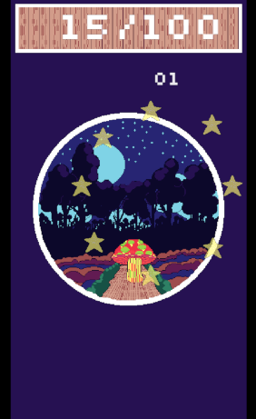

# Clicker Mushroom Predicted

This is a clicker game. But it's not just any clicker it's one with predictions! In short, you’re given a mushroom, and your goal is to grow it by tapping the screen to earn points. Once you've accumulated enough points, the mushroom will fully grow, and you'll receive a prediction about your near future.



### Folder structure

-   `src` - source code for your kaplay project
-   `public` - assets and other static files
-   `dist` - distribution folder, contains your index.html, built js bundle and static assets
-   `screenshot` - image of the game

### Development

To modify the game, clone this repository and run the following command:

```sh
$ npm run dev
```

will start a dev server at http://localhost:8000

### Distribution

```sh
$ npm run build
```

will build your js files into `dist/`

```sh
$ npm run zip
```

will build your game and package into a .zip file, you can upload to your server or itch.io / newground etc.
